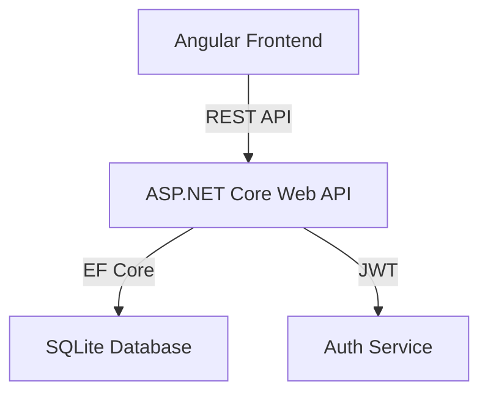

# Architecture Overview

## System Architecture

VehicleMarket follows a classic client-server architecture with a clear separation of concerns between the frontend and backend.

## Backend (ASP.NET Core)

The backend is built using ASP.NET Core 8.0 and follows a clean controller-service-repository pattern.

### Key Components:
- **Controllers**: Handle HTTP requests and map them to service logic.
- **Models**: EF Core entities used for database mapping.
- **DTOs**: Data Transfer Objects used for API communication to avoid leaking internal models.
- **Data (DbContext)**: Configures the SQLite database and seed data.
- **Services**: Contain business logic (e.g., AuthService).

## Frontend (Angular)

The frontend is built with Angular and organized into core, shared, and feature modules.

### Key Components:
- **Core**: Singleton services (Auth, API, Messaging), interceptors, and guards.
- **Shared**: Reusable components like the Navbar, Footer, and UI elements.
- **Features**: Functional modules for Home, Authentication, Listings, Dashboard, Messaging, and Admin.

### State Management:
The application uses RxJS `BehaviorSubject` within services for simple and efficient state management (e.g., `AuthService.currentUser$`).

## Security

- **JWT Authentication**: All sensitive endpoints are protected using JWT tokens.
- **Password Hashing**: Passwords are hashed using BCrypt.Net.
- **Role-Based Authorization**: specific routes (Admin Dashboard) and actions (Approve Listing) are restricted to users with the 'Admin' role.
- **Ownership Checks**: Users can only edit or delete their own listings.
